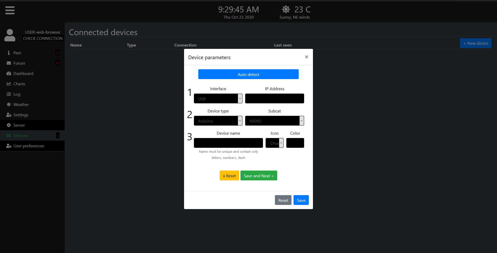

# Smart farm

IOT System that allows live monitoring, storing, analyizing and predicting of grid and off-grid elements data locally and or centrally over internet.

The idea is to have a locally run dashboard independent of any internet services so that it can be used in very remote areas and would not require keeping up to date with 3rd party service changes. But if necessary, there will later be options to sync with internet constantly or at given times / intervals.

Examples
- rain water tank: 
  - calculate rates of consumption
  - fetch past weather data to learn how much rainfall yielded how many liters of water
  - gather past and future data to predict draugths or storms
  - suggest appropriate actions to user (try to save water or use more water before storm)
  - calculate if predictions were correct
  - measure water temperature, to find best times to use devices that heat water
- solar power: 
  - calculate rates of consumption
  - gather weather data, predict shortages, maintenance, useful improvements of solar system (more batteries, more panels, etc.) 
  - regulate consumption (turn devices on or off)


> this is still work in progress and some functions are not implemented yet

## Running it

run ``` python3 /server/server.py```

then open /client/4-mqtt/index.html in your browser to see the dashboard.

Adding your IOT devices:



## Software functionality


- _System_
    - __server scripts__
        - server (center)
            - duplex with all clients
              - clients share: sensor readings, time, weather data
              - admin can set: which client sees and controls what
            - get and send messages / commands
            - talk to other scripts
            - manage users
        - reader / actor (hardware)
            - gets sensor readings
            - sends commands to hardware
        - saver, retriever
            - operates database
            - talks to server, reader, analyzer
            - backup of database to cloud etc
        - analyzer (local)
            - future predictions
            - history analysis
        - fetcher
            - get info from internet
                - weather
                - time
                - farming events
    - __client scripts__
        - server requires login
        - communication with server
        - graphing
    - __database__
        - sensor data
        - actuator data / commands
        - settings
            - client side
            - server side
            - user preferences
            - user info (name, pwd, logon times)
        - user added notes
        - predictions
        - future weather?

## Hardware needed

- Brain:
  - firefly
  - raspberry
  - flatscreen?
  - sim card
  - small router or AP mode? (comms with all distant sensors)
- sensors:
  - water level
  - battery charge level
  - battery voltage
  - light level
  - wind speed
  - temperature
- actuators
  - relays
  - motors
  - leds
